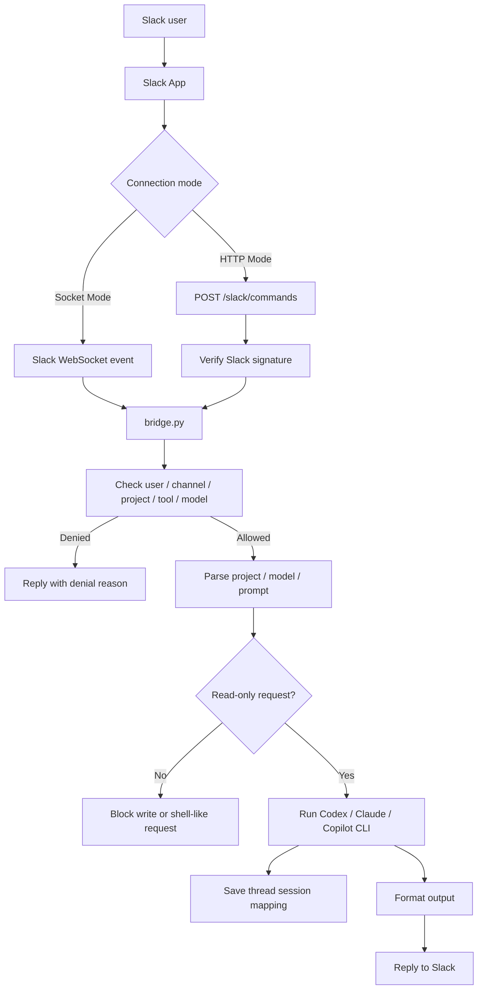

# Slack AI Bridge

**Language:** English | [繁體中文](README.zh-TW.md)

Slack AI Bridge is a local bridge between Slack and AI CLI tools. You can type custom Slack slash commands such as `/ask`, `/review`, or `/copilot`, or mention a bot in Socket Mode, and let local Codex, Claude, or Copilot read allowed projects and reply with results.

The project is designed around one goal: ask questions safely. The bridge checks allowlists for Slack users, channels, projects, tools, and models, then runs local AI CLI tools in read-only and non-interactive mode. Requests to create, modify, delete, install, patch, commit, push, or run arbitrary shell commands are blocked before execution.

## Features

- Supports custom Slack slash commands, such as `/ask -> codex` and `/review -> claude`.
- Supports both Slack Socket Mode and HTTP Mode, so you can choose the connection style that fits your deployment.
- Supports bot mentions and Slack thread continuation, so the same Slack thread can continue the same local CLI session.
- Supports three local AI CLI tools: Codex, Claude, and Copilot.
- Supports a project allowlist and the reserved broad read mode `project=all`.
- Supports private default replies and `--public` channel summaries.
- Can optionally write audit logs and command logs to `logs/`.

## Good Fits

- Quickly asking about the architecture, flow, tests, and risks of a local repo from Slack.
- Letting a team ask controlled questions of local AI CLI tools.
- Keeping Slack as the conversation entry point while limiting actual file access to explicitly allowed projects.

This project is not meant for editing code or deploying systems directly from Slack. The core position of this bridge is read-only assistance.

## Project Structure

```text
slack-ai-bridge/
  bridge.py              # Main program: Slack entrypoints, config loading, allowlists, CLI execution, reply formatting
  config.yaml.example    # Config example: Slack, projects, tools, audit
  .env.example           # Environment variable example: Slack tokens and config path
  requirements.txt       # Python dependencies, mainly slack_sdk
  tests/
    test_bridge.py       # Unit tests
  docs/                  # Extended design and handoff documents
```

After running locally, files such as `.env`, `config.yaml`, `logs/`, and `__pycache__/` may appear. These usually should not be published, especially `.env` and `logs/`, because they may contain tokens, Slack IDs, prompts, or conversation data.

## Flow



## Slack Connection Modes

| Mode | How Slack connects | Public endpoint required | Good for | Start command |
|---|---|---|---|---|
| Socket Mode | The bridge connects to Slack WebSocket, and Slack pushes events over that connection | No | Local development, private teams, avoiding tunnels | `python bridge.py` |
| HTTP Mode | Slack sends POST requests directly to your Request URL | Yes, a public HTTPS URL | Existing servers, reverse proxies, ngrok, or Cloudflare Tunnel | `python bridge.py --http-mode` |

Socket Mode is recommended first because local use does not need a public HTTP endpoint. If you already have a stable public HTTPS URL, HTTP Mode is also supported.

## Slack Setup

### Shared Setup

1. Create a Slack App.
2. Add the `commands` scope in `OAuth & Permissions`.
3. Create the slash commands you need in `Slash Commands`, such as `/ask`, `/review`, and `/copilot`.
4. Install or reinstall the app to your workspace.
5. Get the Slack user IDs and channel IDs, then add them to the allowlist in `config.yaml`.

Slash command names must match `slack.allowed_commands` in `config.yaml`. The recommended map format explicitly assigns each command to a tool:

```yaml
slack:
  allowed_commands:
    "/ask": "codex"
    "/review": "claude"
    "/copilot": "copilot"
```

### Socket Mode

Socket Mode is a good fit for local use. Slack sends slash commands, app mentions, and thread message events through WebSocket.

1. Enable Socket Mode in `Settings > Socket Mode`.
2. Create an App-Level Token in `Basic Information > App-Level Tokens`:
   - Scope: `connections:write`
   - Token format is usually `xapp-...`
   - Put it in `.env` as `SLACK_APP_TOKEN`
3. To use bot mentions and thread continuation, add these scopes in `OAuth & Permissions`:
   - `chat:write`
   - `app_mentions:read`
   - `channels:history`, for public channel threads
   - `groups:history`, for private channel threads
4. Enable event subscriptions in `Event Subscriptions` and subscribe to:
   - `app_mention`
   - `message.channels` or `message.groups`
5. Invite the bot to the Slack channels where it is allowed.
6. Start the bridge:

```bash
python bridge.py
```

### HTTP Mode

HTTP Mode is useful when you already have a public HTTPS endpoint or tunnel. Slack posts slash command payloads to the bridge.

1. Set the command Request URL in `Slash Commands`:

```text
https://<your-public-host>/slack/commands
```

2. Copy the Signing Secret from `Basic Information` and put it in `.env` as `SLACK_SIGNING_SECRET`.
3. Start the bridge:

```bash
python bridge.py --http-mode
```

In HTTP Mode, the local service listens on `127.0.0.1:8799` by default. If you use a tunnel, point the public HTTPS URL to `http://127.0.0.1:8799/slack/commands`.

## Python Setup

Requires Python 3.10+.

Windows:

```bash
python -m pip install -r requirements.txt
copy .env.example .env
copy config.yaml.example config.yaml
```

macOS / Linux:

```bash
python -m pip install -r requirements.txt
cp .env.example .env
cp config.yaml.example config.yaml
```

## `.env` Variables

```text
SLACK_SIGNING_SECRET=...
SLACK_APP_TOKEN=...
SLACK_BOT_TOKEN=...
BRIDGE_CONFIG=config.yaml
```

| Variable | Purpose | Required when |
|---|---|---|
| `SLACK_SIGNING_SECRET` | Slack request signing secret. HTTP Mode uses it to verify Slack POST requests. The current bridge also checks that it exists while loading config. | Required |
| `SLACK_APP_TOKEN` | Slack App-Level Token, usually in the `xapp-...` format. Requires the `connections:write` scope. | Required for Socket Mode |
| `SLACK_BOT_TOKEN` | Slack Bot Token, usually in the `xoxb-...` format. Used to call `chat.postMessage` for bot mentions and thread replies. | Required for bot mentions / thread continuation |
| `BRIDGE_CONFIG` | Path to the config file. | Optional, defaults to `config.yaml` in the project root |

## `config.yaml` Example

For normal projects, `path` must be changed to a local absolute path. The reserved project `all` can be written as `all: {}` and does not need or use a path.

```yaml
server:
  host: "127.0.0.1"
  port: 8799

slack:
  signing_secret_env: "SLACK_SIGNING_SECRET"
  bot_token_env: "SLACK_BOT_TOKEN"
  conversation_store_path: "logs/conversations.json"
  allowed_users:
    - "U0123456789"
  allowed_channels:
    - "C0123456789"
  allowed_commands:
    "/ask": "codex"
    "/review": "claude"
    "/copilot": "copilot"
  echo_command: "preview"

projects:
  all: {}
  default:
    path: "C:/path/to/your/project"

default_project: "default"

tools:
  codex:
    command: "codex"
    allowed_models: [gpt-5.5, gpt-5.4]
  claude:
    command: "claude"
    allowed_models: [claude-sonnet-4-6]
  copilot:
    command: "copilot"
    allowed_models: [default]

skills:
  enabled: false

codex:
  file_access: "project"
  timeout_seconds: 120
  output_mode: "preview"
  output_char_limit: 6000

audit:
  path: "logs/audit.csv"
  command_log_path: "logs/commands.jsonl"
  log_commands_jsonl: false
```

## `config.yaml` Reference

| Section / key | Purpose |
|---|---|
| `server.host` | Host bound by HTTP Mode. `127.0.0.1` is a good default. |
| `server.port` | Port bound by HTTP Mode. `8799` is a good default. |
| `slack.signing_secret_env` | Environment variable that stores the Slack Signing Secret. Defaults to `SLACK_SIGNING_SECRET`. |
| `slack.bot_token_env` | Environment variable that stores the Slack Bot Token. Defaults to `SLACK_BOT_TOKEN`. |
| `slack.conversation_store_path` | Mapping file for Slack threads and local CLI sessions. Defaults to `logs/conversations.json`. |
| `slack.allowed_users` | Slack user IDs allowed to use the bridge. If omitted or set to an empty array `[]`, all users are allowed, while the channel allowlist is still checked. |
| `slack.allowed_channels` | Slack channel ID allowlist for bridge usage. |
| `slack.allowed_commands` | Mapping from slash commands to tools, such as `"/ask": "codex"`. The old list format is also supported and maps `/codex` to `tools.codex`. |
| `slack.echo_command` | Whether to show the prompt in the running message: `none`, `preview`, or `full`. |
| `projects.<name>.path` | Local absolute path for a normal project, such as `C:/Users/name/project`. |
| `projects.all` | Reserved project. When `project=all` is selected, the bridge runs from the system root and uses each CLI's broad read-only access setting. |
| `default_project` | Project used when a Slack message does not specify `project=`. |
| `tools.<name>.command` | Local AI CLI command. Supported tool names are `codex`, `claude`, and `copilot`. On Windows, the file extension can be omitted; the program tries `.cmd`, `.exe`, and `.bat`. |
| `tools.<name>.default_model` | Default model for the tool. Optional. If omitted, the CLI's own default model is used. |
| `tools.<name>.allowed_models` | Models that Slack users are allowed to specify. |
| `skills.enabled` | Reserved setting. Keep it as `false` for now. |
| `codex.file_access` | Codex read scope. `project` only allows the configured project. `all` allows broader read-only disk access. `project=all` also enables broad read access. |
| `codex.timeout_seconds` | Timeout in seconds for local CLI execution. |
| `codex.output_mode` | Slack output display mode: `none`, `preview`, or `full`. |
| `codex.output_char_limit` | Maximum characters shown in `preview` mode. |
| `audit.path` | Path to the audit CSV. Audit logs do not record the full prompt. |
| `audit.command_log_path` | Path to the command JSONL log. |
| `audit.log_commands_jsonl` | Whether to record the full Slack command text. Keep this `false` if prompts may contain sensitive information. |

## Running

Socket Mode is the default mode:

```bash
python bridge.py
```

HTTP Mode:

```bash
python bridge.py --http-mode
```

Specify env and config files:

```bash
python bridge.py --env-file .env --config config.yaml
```

HTTP Mode provides:

```text
GET  /health
POST /slack/commands
```

## Slack Usage

Slash commands:

```text
/ask help
/ask list
/ask list projects
/ask list models
/ask project=default model=gpt-5.5 summarize this repo
/ask project=all model=gpt-5.5 summarize my allowed local workspace
/ask --public summarize this repo for the channel
```

If multiple tools are configured:

```text
/review project=default model=claude-sonnet-4-6 review this module
/copilot project=default model=default explain the failing test
```

Socket Mode bot mentions:

```text
@Bot codex project=default model=gpt-5.5 summarize this repo
@Bot claude project=default model=claude-sonnet-4-6 review this module
@Bot copilot project=default model=default explain the failing test
```

Reply in the same Slack thread to continue. The bridge reuses the local CLI session saved for that thread:

```text
What were the main risks you found?
```

To switch tools, start a new bot mention thread.

## Security Design and Limits

- Only allowlisted Slack channels can use the bridge.
- If `slack.allowed_users` is filled in, only listed users are allowed. If it is omitted or empty, all users are allowed.
- Normal operation only reads local projects explicitly listed under `projects`.
- `project=all` and `codex.file_access: all` expand the read-only scope, so use them only in Slack channels you trust.
- Only models listed in each tool's `allowed_models` can be specified.
- Local CLI tools run in read-only and non-interactive mode, with write, shell, remote, and interactive capabilities disabled or restricted.
- Prompts with write intent are blocked, such as create, edit, delete, install, patch, commit, push, or shell command requests.
- `--public` posts only a short summary to the channel. Full results are still preferably returned to the requester.

## Tests

```bash
python -m unittest discover -s tests
```

## License

This project is licensed under the [MIT License](LICENSE).
