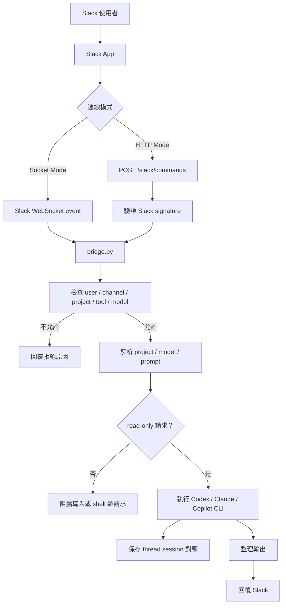

# Slack AI Bridge

**Language:** [English](README.md) | 繁體中文

Slack AI Bridge 是一個跑在本機的 Slack 與 AI CLI 工具橋接器。你可以在 Slack 裡輸入自訂 slash command，例如 `/ask`、`/review`、`/copilot`，或在 Socket Mode 中提及 bot，讓本機的 Codex、Claude、Copilot 讀取允許的專案並回覆結果。

這個專案的設計目標是「安全地問問題」。Bridge 會檢查 Slack 使用者、頻道、專案、工具與模型 allowlist，並用 read-only / non-interactive 方式執行本機 AI CLI。建立、修改、刪除、安裝、patch、commit、push 或任意 shell command 類型的請求會在執行前被擋下。

## 功能特色

- 支援自訂 Slack slash command，例如 `/ask -> codex`、`/review -> claude`。
- 支援 Slack Socket Mode 與 HTTP Mode，可依部署環境選擇連線方式。
- 支援 bot mention 與 Slack thread continuation，同一個 thread 可延續同一個本機 CLI session。
- 支援 Codex、Claude、Copilot 三種本機 CLI 工具。
- 支援 project allowlist，也支援保留的 `project=all` 寬讀取模式。
- 支援 private 預設回覆與 `--public` 頻道摘要。
- 可選擇記錄 audit log 與 command log 到 `logs/`。

## 適合用途

- 在 Slack 中快速詢問某個本機 repo 的架構、流程、測試與風險。
- 讓團隊用受控的方式向本機 AI CLI 提問。
- 保留 Slack 對話入口，同時把實際讀取範圍限制在明確允許的 project。

不適合從 Slack 直接修改程式碼或部署系統；這個 bridge 的核心定位是 read-only 協助。

## 專案結構

```text
slack-ai-bridge/
  bridge.py              # 主程式：Slack 入口、設定讀取、allowlist、CLI 執行、回覆格式
  config.yaml.example    # 設定範例：Slack、project、tools、audit
  .env.example           # 環境變數範例：Slack tokens 與 config path
  requirements.txt       # Python dependency，主要是 slack_sdk
  tests/
    test_bridge.py       # 單元測試
  docs/                  # 延伸設計與交接文件
```

本機執行後可能會出現 `.env`、`config.yaml`、`logs/`、`__pycache__/` 等檔案；這些通常不應公開，尤其 `.env` 與 `logs/` 可能包含 token、Slack ID、prompt 或對話資訊。

## 運作流程



## Slack 連線模式

| 模式 | Slack 如何連線 | 是否需要公開 endpoint | 適合情境 | 啟動方式 |
|---|---|---|---|---|
| Socket Mode | bridge 主動連到 Slack WebSocket，Slack 透過連線推送事件 | 不需要 | 本機開發、私人團隊、不想架 tunnel | `python bridge.py` |
| HTTP Mode | Slack 直接 POST 到你的 Request URL | 需要公開 HTTPS URL | 已有 server、reverse proxy、ngrok 或 Cloudflare Tunnel | `python bridge.py --http-mode` |

建議優先使用 Socket Mode，因為本機不需要暴露公開 HTTP endpoint。若你已經有穩定的公開 HTTPS URL，HTTP Mode 也可以使用。

## Slack 設定

### 共通設定

1. 建立 Slack App。
2. 到 `OAuth & Permissions` 加上 `commands` scope。
3. 到 `Slash Commands` 建立需要的 command，例如 `/ask`、`/review`、`/copilot`。
4. Install 或 Reinstall app 到 workspace。
5. 取得 Slack user ID 與 channel ID，填入 `config.yaml` 的 allowlist。

Slash command 名稱必須與 `config.yaml` 的 `slack.allowed_commands` 對得上。建議使用 map 格式，明確指定 command 要呼叫哪個工具：

```yaml
slack:
  allowed_commands:
    "/ask": "codex"
    "/review": "claude"
    "/copilot": "copilot"
```

### Socket Mode

Socket Mode 適合本機使用。Slack 會透過 WebSocket 傳送 slash command、app mention 與 thread message event。

1. 到 `Settings > Socket Mode` 啟用 Socket Mode。
2. 到 `Basic Information > App-Level Tokens` 建立 App-Level Token：
   - Scope：`connections:write`
   - Token 格式通常是 `xapp-...`
   - 填入 `.env` 的 `SLACK_APP_TOKEN`
3. 若要使用 bot mention 與 thread continuation，到 `OAuth & Permissions` 加上：
   - `chat:write`
   - `app_mentions:read`
   - `channels:history`，用於 public channel thread
   - `groups:history`，用於 private channel thread
4. 到 `Event Subscriptions` 啟用事件並訂閱：
   - `app_mention`
   - `message.channels` 或 `message.groups`
5. 把 bot 邀進允許使用的 Slack channel。
6. 啟動 bridge：

```bash
python bridge.py
```

### HTTP Mode

HTTP Mode 適合你已有公開 HTTPS endpoint 或 tunnel 的情境。Slack 會把 slash command payload POST 到 bridge。

1. 到 `Slash Commands` 設定 command 的 Request URL：

```text
https://<your-public-host>/slack/commands
```

2. 到 `Basic Information` 複製 Signing Secret，填入 `.env` 的 `SLACK_SIGNING_SECRET`。
3. 啟動 bridge：

```bash
python bridge.py --http-mode
```

HTTP Mode 本機服務預設 listen 在 `127.0.0.1:8799`。如果你使用 tunnel，請把公開 HTTPS URL 指到本機的 `http://127.0.0.1:8799/slack/commands`。

## Python 設定

需要 Python 3.10+。

Windows：

```bash
python -m pip install -r requirements.txt
copy .env.example .env
copy config.yaml.example config.yaml
```

macOS / Linux：

```bash
python -m pip install -r requirements.txt
cp .env.example .env
cp config.yaml.example config.yaml
```

## `.env` 參數

```text
SLACK_SIGNING_SECRET=...
SLACK_APP_TOKEN=...
SLACK_BOT_TOKEN=...
BRIDGE_CONFIG=config.yaml
```

| 參數 | 用途 | 何時需要 |
|---|---|---|
| `SLACK_SIGNING_SECRET` | Slack request signing secret。HTTP Mode 會用它驗證 Slack POST request；目前 bridge 載入設定時也會檢查它存在。 | 必填 |
| `SLACK_APP_TOKEN` | Slack App-Level Token，格式通常是 `xapp-...`，需要 `connections:write` scope。 | Socket Mode 必填 |
| `SLACK_BOT_TOKEN` | Slack Bot Token，格式通常是 `xoxb-...`，用來呼叫 `chat.postMessage` 回覆 bot mention 與 thread。 | bot mention / thread continuation 必填 |
| `BRIDGE_CONFIG` | 指定設定檔路徑。 | 可選，預設是專案根目錄的 `config.yaml` |

## `config.yaml` 範例

一般 project 的 `path` 必須改成本機絕對路徑。保留 project `all` 可寫成 `all: {}`，不需要也不使用 path。

```yaml
server:
  host: "127.0.0.1"
  port: 8799

slack:
  signing_secret_env: "SLACK_SIGNING_SECRET"
  bot_token_env: "SLACK_BOT_TOKEN"
  conversation_store_path: "logs/conversations.json"
  allowed_users:
    - "U0123456789"
  allowed_channels:
    - "C0123456789"
  allowed_commands:
    "/ask": "codex"
    "/review": "claude"
    "/copilot": "copilot"
  echo_command: "preview"

projects:
  all: {}
  default:
    path: "C:/path/to/your/project"

default_project: "default"

tools:
  codex:
    command: "codex"
    allowed_models: [gpt-5.5, gpt-5.4]
  claude:
    command: "claude"
    allowed_models: [claude-sonnet-4-6]
  copilot:
    command: "copilot"
    allowed_models: [default]

skills:
  enabled: false

codex:
  file_access: "project"
  timeout_seconds: 120
  output_mode: "preview"
  output_char_limit: 6000

audit:
  path: "logs/audit.csv"
  command_log_path: "logs/commands.jsonl"
  log_commands_jsonl: false
```

## `config.yaml` 參數

| 區塊 / 參數 | 用途 |
|---|---|
| `server.host` | HTTP Mode 綁定的 host，預設可用 `127.0.0.1`。 |
| `server.port` | HTTP Mode 綁定的 port，預設可用 `8799`。 |
| `slack.signing_secret_env` | 指向哪個環境變數保存 Slack Signing Secret，預設是 `SLACK_SIGNING_SECRET`。 |
| `slack.bot_token_env` | 指向哪個環境變數保存 Slack Bot Token，預設是 `SLACK_BOT_TOKEN`。 |
| `slack.conversation_store_path` | Slack thread 與本機 CLI session 的對應檔，預設可放在 `logs/conversations.json`。 |
| `slack.allowed_users` | 允許使用 bridge 的 Slack user ID。省略或設為空陣列 `[]` 代表允許所有使用者；仍會檢查 channel allowlist。 |
| `slack.allowed_channels` | 允許使用 bridge 的 Slack channel ID allowlist。 |
| `slack.allowed_commands` | slash command 對工具的對應表，例如 `"/ask": "codex"`。也支援舊的 list 格式，會把 `/codex` 對應到同名 `tools.codex`。 |
| `slack.echo_command` | 是否在 running 訊息中顯示 prompt：`none`、`preview`、`full`。 |
| `projects.<name>.path` | 一般 project 的本機絕對路徑，例如 `C:/Users/name/project`。 |
| `projects.all` | 保留 project；選 `project=all` 時 bridge 會從系統根目錄執行，並使用各 CLI 的 read-only 寬讀取設定。 |
| `default_project` | Slack 訊息沒有指定 `project=` 時使用的 project。 |
| `tools.<name>.command` | 本機 AI CLI 指令。支援的 tool 名稱是 `codex`、`claude`、`copilot`。Windows 可不寫副檔名，程式會嘗試 `.cmd`、`.exe`、`.bat`。 |
| `tools.<name>.default_model` | 該 tool 的預設模型。可省略，省略時使用 CLI 自己的預設模型。 |
| `tools.<name>.allowed_models` | 允許 Slack 使用者指定的模型清單。 |
| `skills.enabled` | 預留設定，目前保持 `false`。 |
| `codex.file_access` | Codex 讀取範圍：`project` 只允許設定的 project；`all` 允許更廣的 read-only 磁碟讀取。`project=all` 也會啟用寬讀取。 |
| `codex.timeout_seconds` | 本機 CLI 執行逾時秒數。 |
| `codex.output_mode` | Slack 顯示輸出模式：`none`、`preview`、`full`。 |
| `codex.output_char_limit` | `preview` 模式最多顯示的字元數。 |
| `audit.path` | audit CSV 路徑。Audit log 不記錄完整 prompt。 |
| `audit.command_log_path` | command JSONL log 路徑。 |
| `audit.log_commands_jsonl` | 是否記錄完整 Slack command text。若 prompt 可能含敏感資訊，建議維持 `false`。 |

## 啟動方式

Socket Mode 是預設模式：

```bash
python bridge.py
```

HTTP Mode：

```bash
python bridge.py --http-mode
```

指定環境檔與設定檔：

```bash
python bridge.py --env-file .env --config config.yaml
```

HTTP Mode 會提供：

```text
GET  /health
POST /slack/commands
```

## Slack 使用方法

Slash command：

```text
/ask help
/ask list
/ask list projects
/ask list models
/ask project=default model=gpt-5.5 summarize this repo
/ask project=all model=gpt-5.5 summarize my allowed local workspace
/ask --public summarize this repo for the channel
```

如果設定多個工具：

```text
/review project=default model=claude-sonnet-4-6 review this module
/copilot project=default model=default explain the failing test
```

Socket Mode bot mention：

```text
@Bot codex project=default model=gpt-5.5 summarize this repo
@Bot claude project=default model=claude-sonnet-4-6 review this module
@Bot copilot project=default model=default explain the failing test
```

在同一個 Slack thread 繼續回覆，bridge 會沿用該 thread 保存的本機 CLI session：

```text
What were the main risks you found?
```

若要切換工具，請開一個新的 bot mention thread。

## 安全設計與限制

- 只有 allowlist 中的 Slack channel 可以使用。
- `slack.allowed_users` 有填時只允許清單內使用者；省略或空陣列代表允許所有使用者。
- 一般情況只讀取 `projects` 中明確列出的本機專案。
- `project=all` 與 `codex.file_access: all` 會擴大 read-only 讀取範圍，請只在你信任的 Slack channel 使用。
- 只有各 tool `allowed_models` 裡的模型可以被指定。
- 本機 CLI 以 read-only / non-interactive 方式執行，並停用或限制寫入、shell、遠端與互動能力。
- 含有寫入意圖的 prompt 會被擋下，例如 create、edit、delete、install、patch、commit、push、shell command。
- `--public` 只貼出短摘要到頻道；完整結果仍優先回給請求者。

## 測試

```bash
python -m unittest discover -s tests
```

## 授權

本專案採用 [MIT License](LICENSE) 授權。
